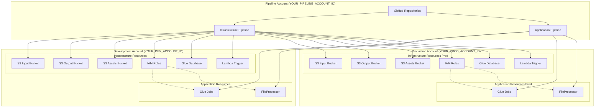
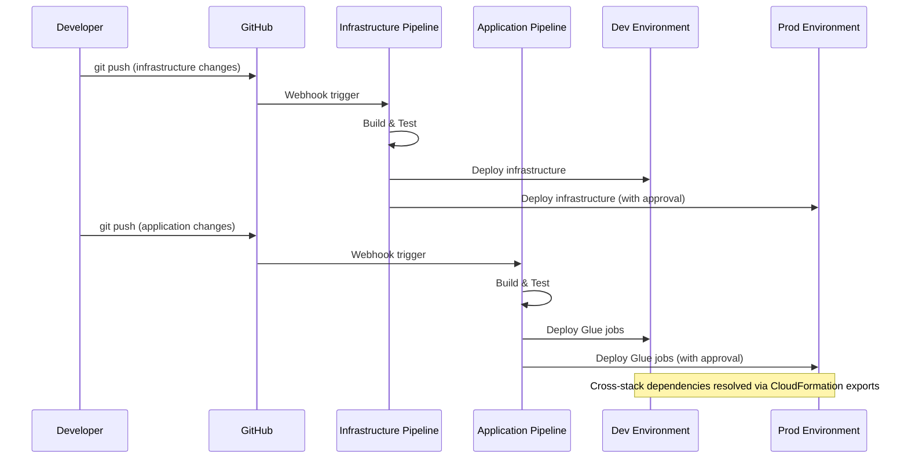
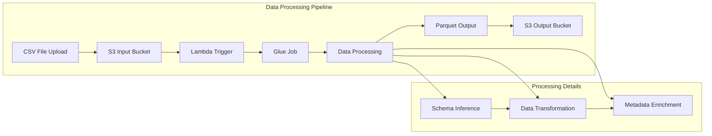
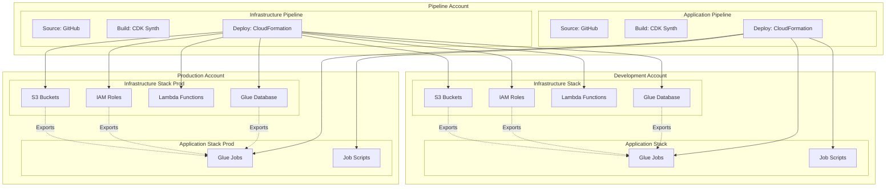
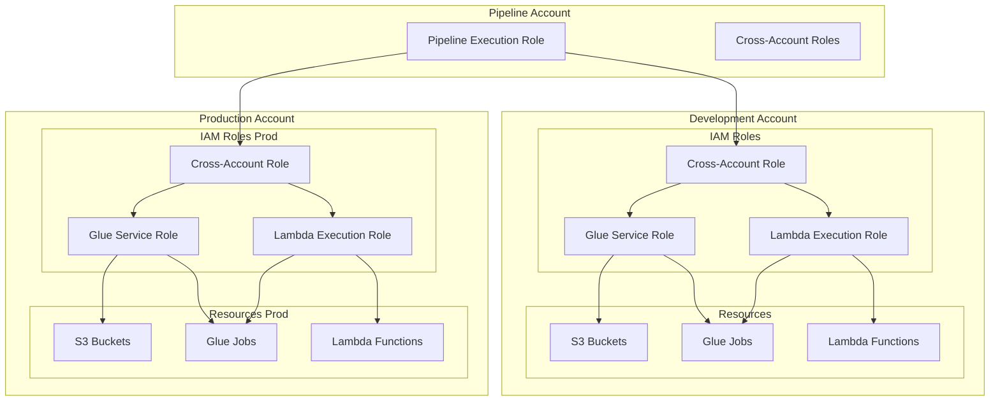
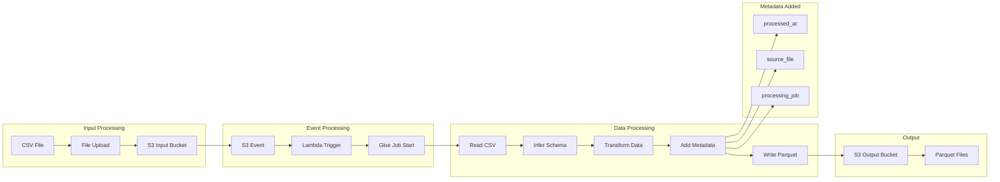
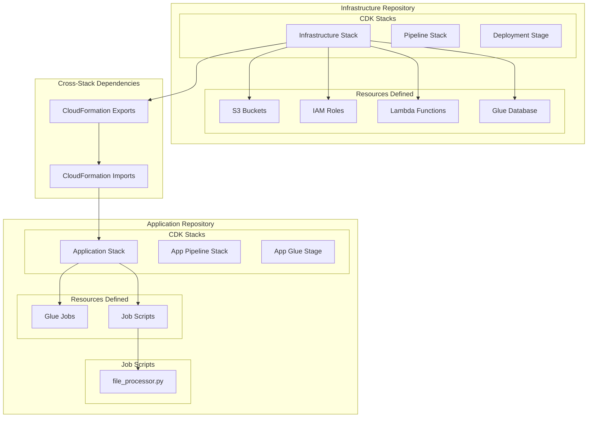
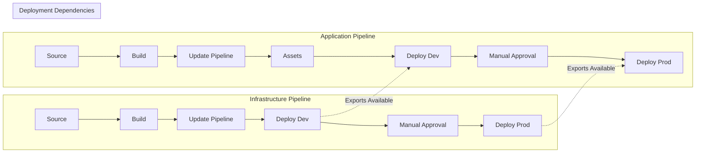
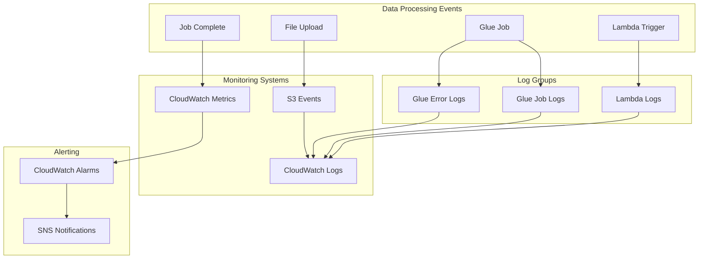

# AWS Glue Data Pipeline Architecture Diagrams

## 🏗️ Overall Architecture Overview

## 🔄 CI/CD Pipeline Flow

## 📊 Data Processing Flow

## 🏢 Multi-Account Architecture

## 🔐 Security & IAM Architecture

## 📈 Data Transformation Detail

## 🔄 Repository Organization

## 🚀 Deployment Pipeline Stages

## 📊 Monitoring & Observability

---

## 🎯 Key Architecture Benefits

### 1. **Separation of Concerns**
- Infrastructure and application code in separate repositories
- Independent deployment cycles
- Clear ownership boundaries

### 2. **GitOps Workflow**
- All changes tracked in Git
- Automated deployment from commits
- Rollback capability through Git history

### 3. **Multi-Account Security**
- Production isolation
- Least privilege access
- Cross-account role assumption

### 4. **Event-Driven Processing**
- Real-time file processing
- Automatic scaling
- No manual intervention required

### 5. **Observability**
- Comprehensive logging
- Metrics and monitoring
- Error tracking and alerting

---

## 💡 Tips for Better Diagram Viewing

Since Mermaid diagrams in Markdown can appear small, here are some tips:

1. **Browser Zoom**: Use Ctrl/Cmd + Plus to zoom in on the entire page
2. **Copy to Mermaid Live**: Copy any diagram code and paste it into [mermaid.live](https://mermaid.live) for full-screen viewing
3. **VS Code Extension**: Use the Mermaid Preview extension in VS Code for better rendering
4. **Export Options**: Most Mermaid viewers allow exporting to PNG/SVG for presentations

*These diagrams provide a complete visual representation of the enterprise data pipeline architecture, suitable for technical presentations and documentation.*