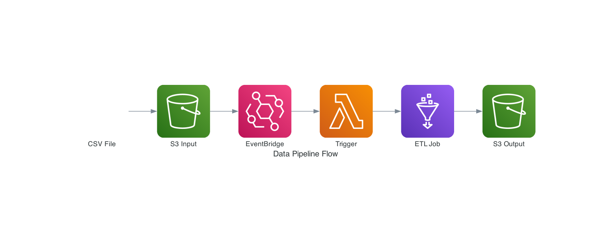
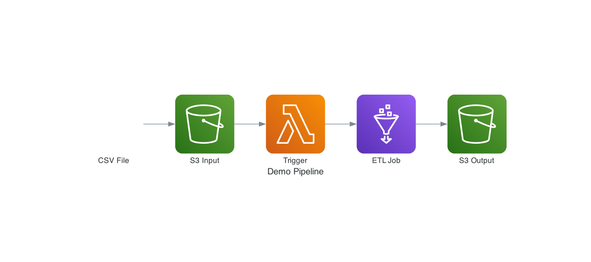
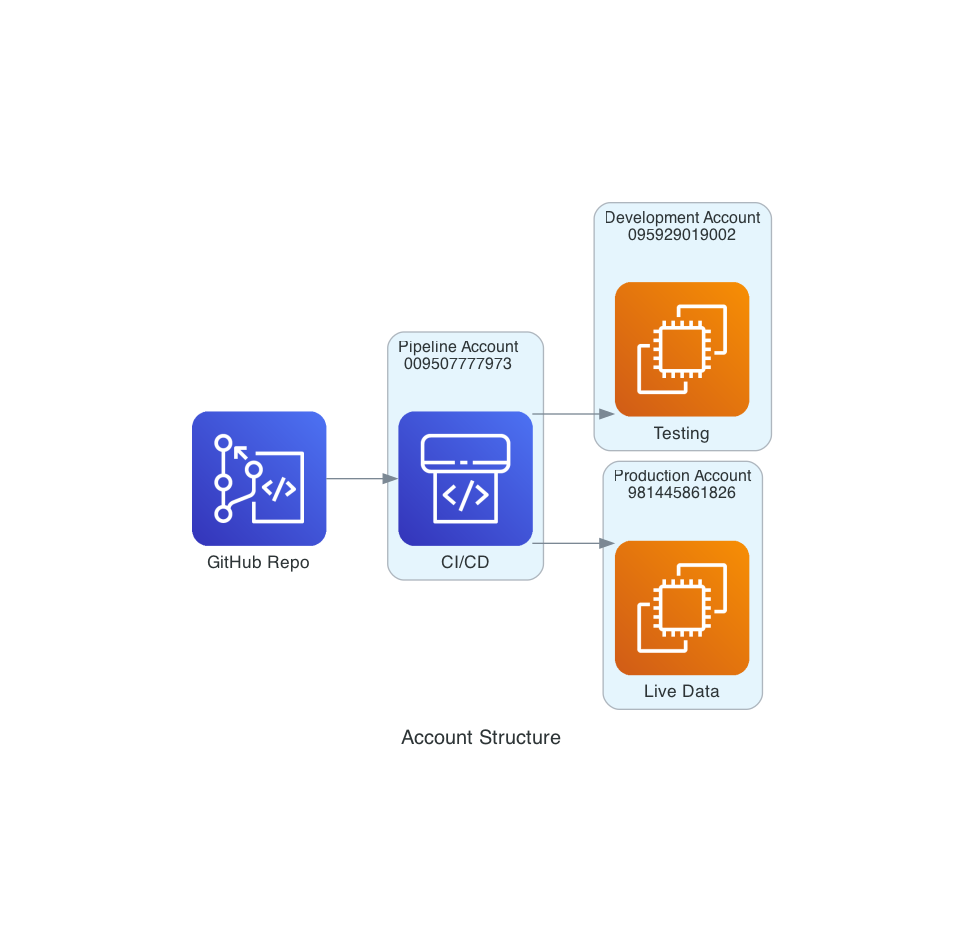
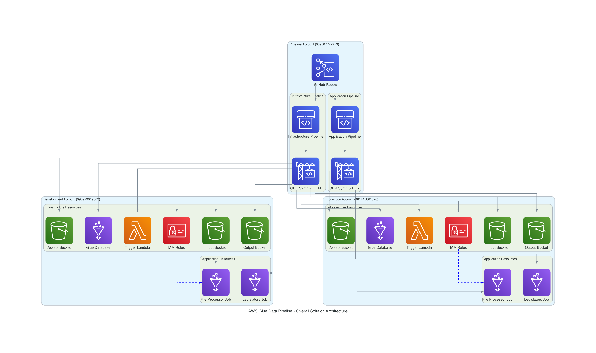
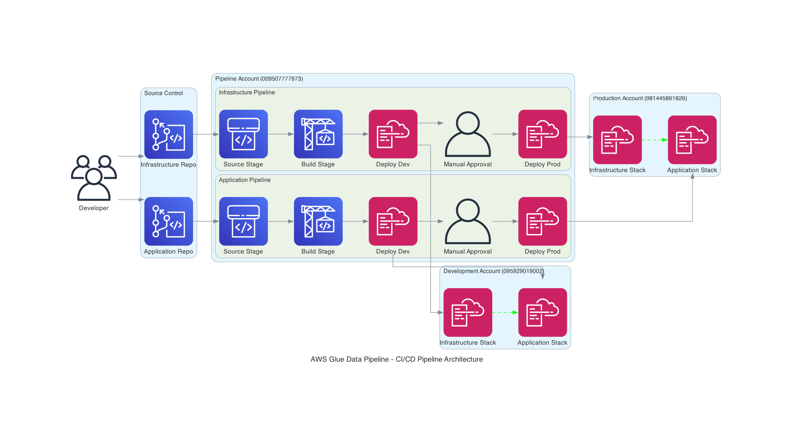
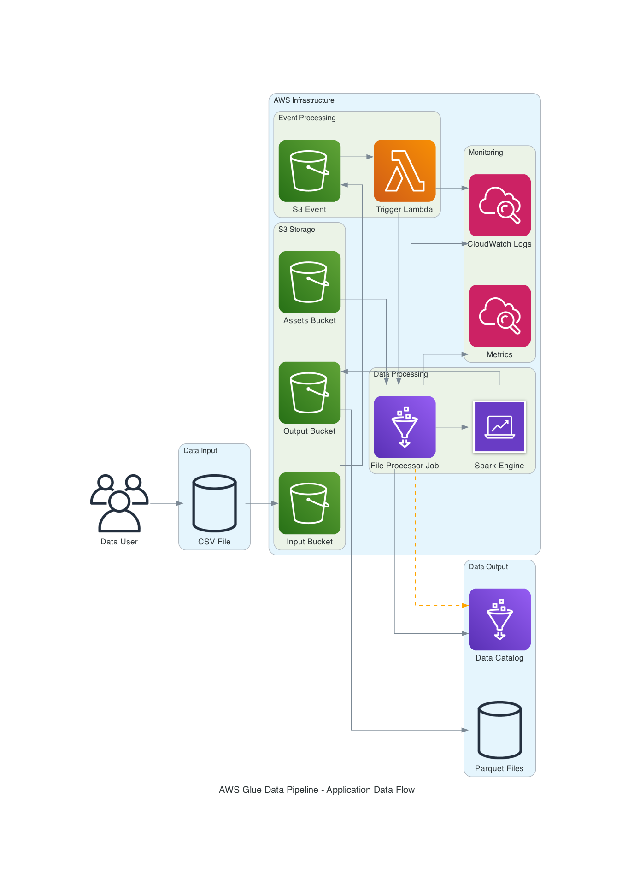
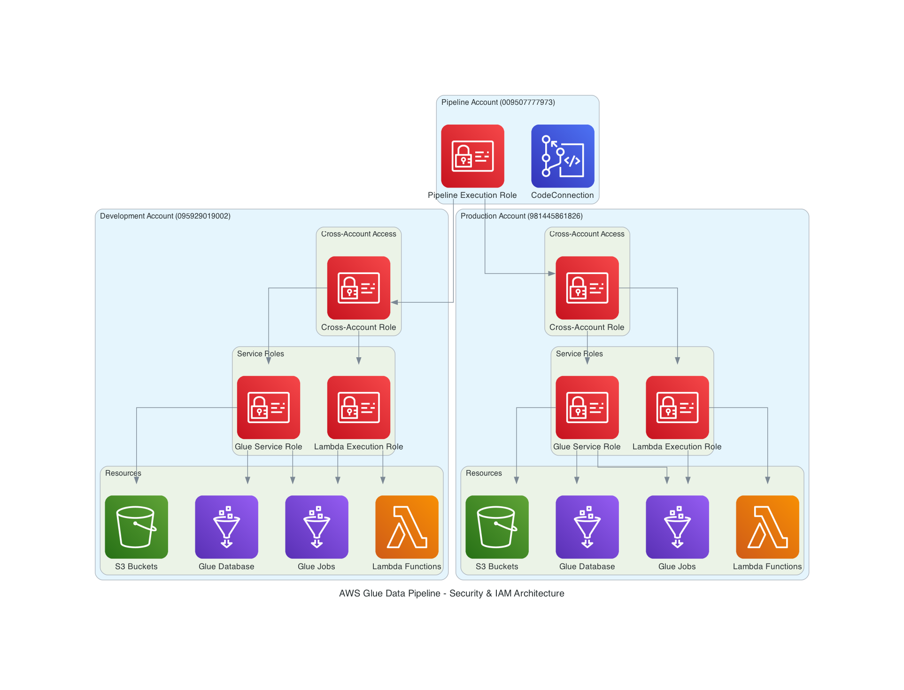
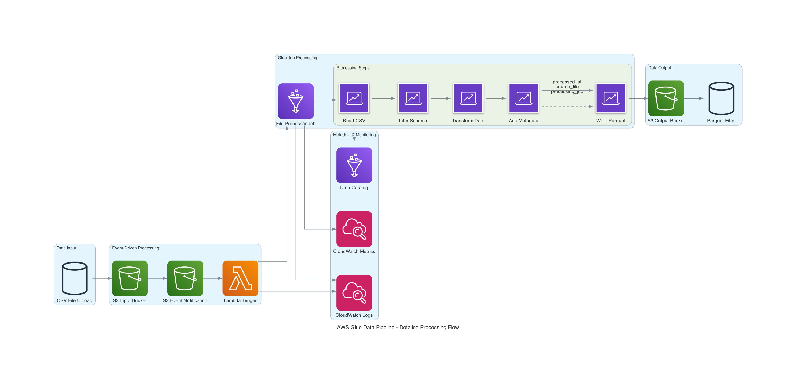
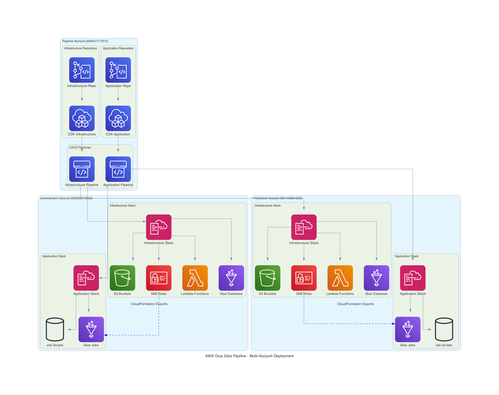

# AWS Glue Data Pipeline - Architecture Documentation

## Simple Architecture Overview

### Data Pipeline Flow


### Demo Pipeline


### Account Structure  


## Overview

This document provides comprehensive architecture diagrams and documentation for the AWS Glue Data Pipeline solution. The solution implements a multi-account, event-driven data processing pipeline using AWS Glue, S3, Lambda, and CI/CD best practices.

## Architecture Components

### 1. Overall Solution Architecture


**Key Components:**
- **Pipeline Account (YOUR_PIPELINE_ACCOUNT_ID)**: Centralized CI/CD pipelines for infrastructure and application deployment
- **Development Account (YOUR_DEV_ACCOUNT_ID)**: Development environment for testing and validation
- **Production Account (YOUR_PROD_ACCOUNT_ID)**: Production environment for live data processing
- **Separation of Concerns**: Infrastructure and application code managed in separate repositories and pipelines

**Benefits:**
- Clear separation between infrastructure and application concerns
- Multi-account isolation for security and governance
- Automated deployment with GitOps workflow
- Cross-stack dependencies managed via CloudFormation exports

### 2. CI/CD Pipeline Architecture


**Pipeline Flow:**
1. **Source Stage**: GitHub repositories trigger pipelines on code changes
2. **Build Stage**: CDK synthesis and validation
3. **Deploy Dev**: Automatic deployment to development account
4. **Manual Approval**: Human approval gate for production deployment
5. **Deploy Prod**: Deployment to production account

**Key Features:**
- Separate pipelines for infrastructure and application code
- Cross-account deployment capabilities
- Manual approval gates for production
- Automated rollback capabilities
- CloudFormation-based deployments

### 3. Application Data Flow


**Data Processing Flow:**
1. **Data Input**: Users upload CSV files to S3 input bucket
2. **Event Processing**: S3 events trigger Lambda function
3. **Job Execution**: Lambda starts Glue job for CSV processing
4. **Data Transformation**: Spark engine processes data with schema inference
5. **Output Generation**: Processed data saved as Parquet files
6. **Metadata Management**: Data catalog updated with schema information

**Processing Features:**
- Event-driven architecture (no manual intervention required)
- Automatic schema inference from CSV files
- Metadata enrichment (processed_at, source_file, processing_job)
- Parquet format for optimized analytics
- Comprehensive logging and monitoring

### 4. Security & IAM Architecture


**Security Model:**
- **Cross-Account Roles**: Pipeline account assumes roles in target accounts
- **Service Roles**: Dedicated roles for Glue and Lambda services
- **Least Privilege**: Minimal permissions for each service
- **Resource-Based Policies**: S3 bucket policies for additional security

**IAM Structure:**
- Pipeline execution role in pipeline account
- Cross-account roles in dev/prod accounts
- Service-specific roles (Glue, Lambda)
- Resource-level permissions for S3, Glue, CloudWatch

### 5. Detailed Processing Flow


**Processing Steps:**
1. **CSV Upload**: File uploaded to S3 input bucket
2. **Event Notification**: S3 triggers Lambda via event notification
3. **Job Initiation**: Lambda starts Glue job with file parameters
4. **Data Reading**: Spark reads CSV with header and schema inference
5. **Schema Inference**: Automatic detection of data types
6. **Data Transformation**: Apply business logic and transformations
7. **Metadata Addition**: Add processing metadata columns
8. **Parquet Writing**: Write optimized Parquet files to output bucket

**Metadata Added:**
- `processed_at`: Timestamp of processing
- `source_file`: Original CSV filename
- `processing_job`: Glue job name that processed the file

### 6. Multi-Account Deployment


**Deployment Strategy:**
- **Infrastructure First**: Deploy infrastructure resources before applications
- **Cross-Stack Dependencies**: Use CloudFormation exports/imports
- **Account Isolation**: Separate accounts for different environments
- **Centralized Pipelines**: All deployments managed from pipeline account

**Repository Structure:**
- **Infrastructure Repository**: CDK code for AWS resources (S3, IAM, Lambda, Glue Database)
- **Application Repository**: CDK code for Glue jobs and processing logic
- **Separate Pipelines**: Independent deployment cycles for infrastructure and applications

## Technical Implementation Details

### Infrastructure Stack Components

**S3 Buckets:**
- Input Bucket: Receives CSV files for processing
- Output Bucket: Stores processed Parquet files
- Assets Bucket: Stores Glue job scripts and dependencies

**IAM Roles:**
- Glue Service Role: Permissions for S3 access and Glue operations
- Lambda Execution Role: Permissions to start Glue jobs
- Cross-Account Role: Allows pipeline account to deploy resources

**Lambda Function:**
- Triggers on S3 object creation events
- Filters for CSV files only
- Starts Glue job with dynamic parameters
- Includes error handling and logging

**Glue Database:**
- Stores metadata for processed datasets
- Enables data catalog functionality
- Supports schema evolution

### Application Stack Components

**Glue Jobs:**
- File Processor Job: Event-driven CSV to Parquet conversion
- Legislators Job: Batch processing for sample dataset
- Configurable concurrency and timeout settings
- Comprehensive error handling

**Job Scripts:**
- Python-based ETL logic using PySpark
- Schema inference and validation
- Metadata enrichment
- Optimized Parquet output

### Configuration Management

**Environment-Specific Configuration:**
```yaml
pipelineAccount:
  awsAccountId: YOUR_PIPELINE_ACCOUNT_ID
  awsRegion: YOUR_PREFERRED_REGION

devAccount:
  awsAccountId: YOUR_DEV_ACCOUNT_ID
  awsRegion: YOUR_PREFERRED_REGION

prodAccount:
  awsAccountId: YOUR_PROD_ACCOUNT_ID
  awsRegion: YOUR_PREFERRED_REGION
```

**Application Configuration:**
- Job-specific parameters
- Input/output locations
- Processing options
- Environment variables

## Monitoring and Observability

**CloudWatch Integration:**
- Lambda function logs
- Glue job execution logs
- S3 access logs
- Custom metrics for job success/failure

**Alerting:**
- Job failure notifications
- Processing time thresholds
- Error rate monitoring
- Resource utilization alerts

## Best Practices Implemented

1. **Infrastructure as Code**: All resources defined in CDK
2. **GitOps Workflow**: All changes tracked in Git
3. **Multi-Account Strategy**: Environment isolation and security
4. **Event-Driven Architecture**: Automatic processing without manual intervention
5. **Monitoring and Logging**: Comprehensive observability
6. **Security by Design**: Least privilege access and cross-account roles
7. **Scalability**: Concurrent job execution and auto-scaling
8. **Cost Optimization**: Pay-per-use model with Glue and Lambda

## Deployment Instructions

1. **Prerequisites**: AWS CLI, CDK, appropriate IAM permissions
2. **Infrastructure Deployment**: Deploy infrastructure stack first
3. **Application Deployment**: Deploy application stack after infrastructure
4. **Testing**: Upload sample CSV files to verify end-to-end processing
5. **Monitoring**: Check CloudWatch logs and metrics

## Future Enhancements

- **Data Quality Checks**: Implement data validation rules
- **Schema Registry**: Centralized schema management
- **Data Lineage**: Track data transformation history
- **Cost Optimization**: Implement lifecycle policies for S3
- **Advanced Analytics**: Integration with Amazon Athena or Redshift
- **Real-time Processing**: Add Kinesis for streaming data

---

*This documentation provides a complete overview of the AWS Glue Data Pipeline architecture, suitable for technical teams, stakeholders, and operational staff.*
